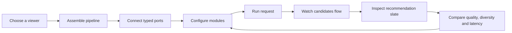

# RecSys Foundry - UX blueprint

## Product idea

RecSys Foundry is a playable system diagram. A learner assembles a recommendation pipeline,
runs a MovieLens-style request through it, and inspects what every module changed.

The graph is the primary surface. Configuration and results stay secondary, so the learner
always sees cause and effect in one frame.

## Experience map



## Desktop composition

```text
+----------------------------------------------------------------------------------+
| REC.SYS FOUNDRY   Viewer: U-104   Template: Hybrid             RUN PIPELINE       |
+-------------+--------------------------------------------+-----------------------+
| MODULES     |                                            | INSPECTOR             |
|             |  Ratings -> Popularity ----\               | Matrix retrieval      |
| Sources     |            MF retrieval ----+-> Blend      | Candidates       16   |
| Retrieval   |  Features -> Vector search -/      |       | Neighbours        6   |
| Ranking     |                                Filters     | Strength        0.72   |
| Evaluation  |                                   |        | [ configuration ]     |
|             |                              Rank -> Slate |                       |
+-------------+--------------------------------------------+-----------------------+
| LIVE SLATE        01 Film card   02 Film card   03 Film card   04 Film card      |
| NDCG 0.84   Diversity 0.71   Coverage 42%   Latency 38 ms   Trace: 48 -> 4       |
+----------------------------------------------------------------------------------+
```

## Mobile composition

```text
+------------------------------+
| FOUNDRY       Viewer     Run  |
+------------------------------+
| Graph / Slate / Modules tabs  |
+------------------------------+
|                              |
|       pan + zoom graph       |
|                              |
+------------------------------+
| selected node summary        |
| configuration drawer         |
+------------------------------+
```

## Node language

| Family | Visual | Behaviour |
| --- | --- | --- |
| Data | neutral cyan deck | emits ratings, films and viewer features |
| Retrieval | teal split block | produces a candidate set with source reasons |
| Control | yellow gate | filters, blends or constrains a set |
| Ranking | coral score stack | changes ordering and exposes score weights |
| Evaluation | green lens | computes slate and system metrics |
| Output | ink delivery tile | renders the final recommendation slate |

Every node exposes a count before and after processing, estimated latency, typed handles and a
small status light. Animated edges indicate the most recent request trace, not ambient decoration.

## Simulation rules

1. A source emits the local MovieLens-style ratings table.
2. Popularity, collaborative and vector retrieval can run in parallel.
3. Blend merges duplicate films and preserves explanations from every source.
4. Seen-item and genre filters remove candidates before ranking.
5. The ranker combines affinity, popularity and freshness.
6. MMR trades relevance for genre diversity.
7. The output keeps top-k and reports quality, coverage, diversity and total latency.

## Interaction principles

- Drag modules from the palette or start from a working template.
- Connect only compatible output and input handles.
- Select a node to tune it without leaving the graph.
- Run is always available, but invalid pipelines explain the missing connection in place.
- A run animates left to right and updates counts progressively.
- Result cards explain why each film survived the pipeline.
- Reset restores the chosen template, not an empty canvas.

## Visual direction

- Light technical canvas on top of the cloud-world palette.
- Graph nodes use flat surfaces, crisp shadows and a maximum 7px radius.
- Cyan communicates data, coral action, yellow decisions, green successful output.
- Monospace is reserved for IDs, scores and latency.
- No decorative animation without information; moving packets always represent the current trace.

